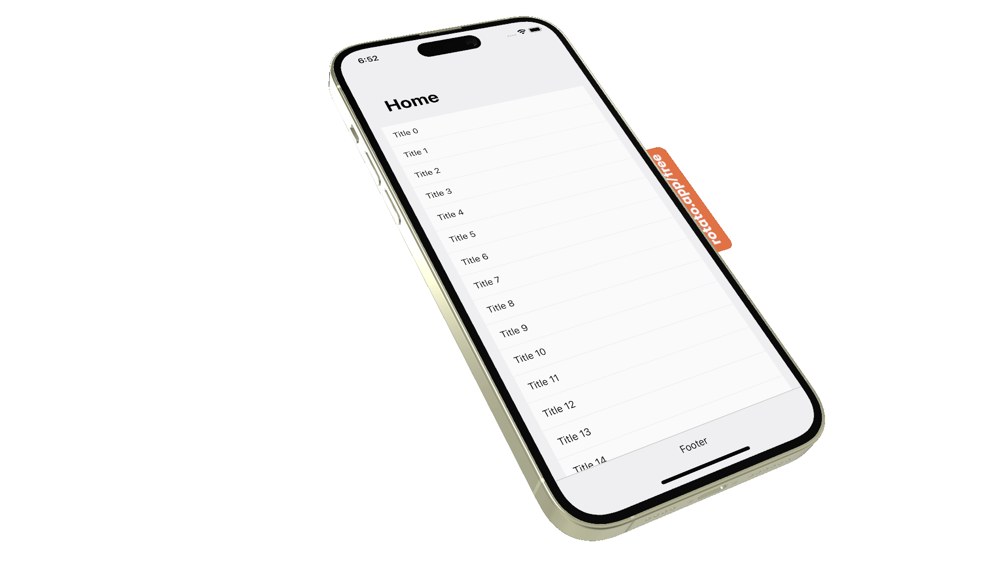

# FlatList Navigation Moving Header

React Native example of how to use a FlatList (or ScrollView) with a page header that moves to the navigation bar when scrolling down and moves back when scrolling up again.

  

Original movie recorded on iPhone 14 Pro Max simulator (mp4). Using Rotato the movie was dragged into an iPhone 14 Pro Max frame and exported as as a Apple ProRes4444 movie in 1080p. Before exporting make sure you update the screen dimensions in the top right corner so the movie nicely fits the frame. Also make sure the background is set to 'transparent' before exporting. The Apple ProRes4444 movie was then converted into an animated gif using Gifski (right click movie as choose open with -> Gifski). Dimensions chosen 1920x1080, speed (2x), FPS (max) and Quality (max) and Loop Forever.

Features:

- Works on both iOS and Android
- FPS close to the max (60) due to minimal react re-renders, both on iOS and Android
- Uses React Native Navigation
- The example uses a FlatList, but the exact same technique works with a ScrollView (FlatList uses a ScrollView internally anyway)

Based on the excellent work of the good people at Coinbase:

https://www.coinbase.com/blog/coinbases-animated-tabbar-in-react-native

## Good to know

- The FlatList (or ScrollView) is actually alligned just below the navbar. The illusion of being below the page header is created by setting the contentInset top property to the height of the page header (iOS only). ContentOffset is also needed for iOS. This specifies how much the user scrolled within the FlatList or ScrollView

- Its a good idea to keep track of the UI and JS frame rates using the Performance Monitor in both the iOS and Android emulators. In the Android emulator press Cmd->M and click on "Show Performance Monitor". The first time you have to give the Expo App permission to display content over other apps. In the iOS simulator choose "Shake" in the Device menu (Ctrl, Command, Z)

- Minimizing re-renders is important to make sure the frame rate stays close to 60 fps. UseCallback(), useMemo() and memo() are your friends here. For child components return default memo(ChildComponent) makes sure the ChildComponent is only re-rendered when its props change. Make sure event handler props passed down to ChildComponents use useCallback() in the parent component to avoid ChildComponent re-renders because the event handler prop changes each time the parent component is re-rendered
